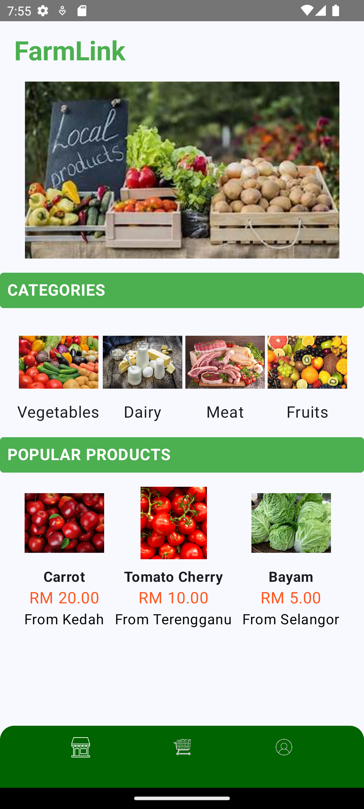
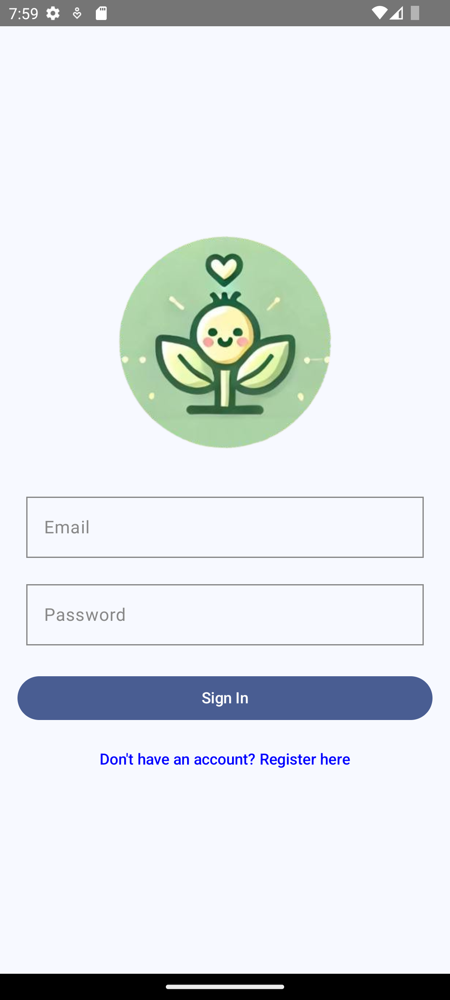
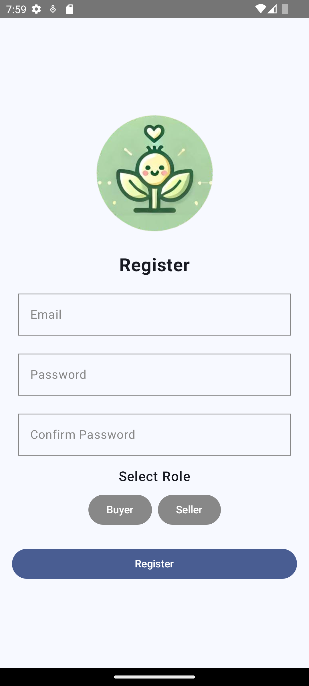
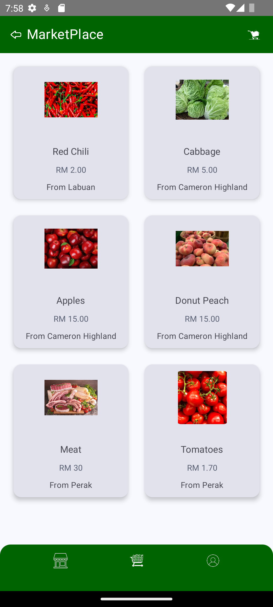

# Farmlink Mobile Marketplace App

This application was developed as part of a university project to improve direct access between farmers and consumers through a mobile platform.

## Features
- Product listing and browsing
- Category-based filtering
- Product detail navigation
- Firebase backend integration

## Technologies
- Android Studio
- Java
- Firebase

## Status
Completed (Student Project)
## Screenshots

### Home Screen

### Login Page

### Register Page

### Marketplace

### Profile & Product Management
.png)
